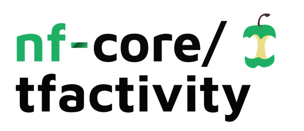
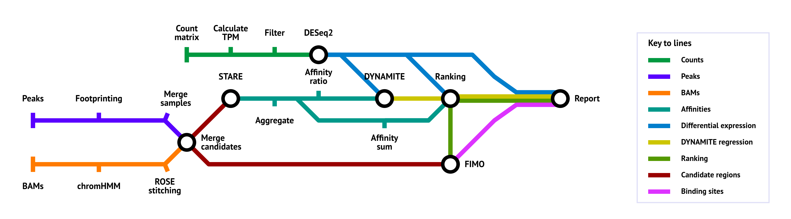
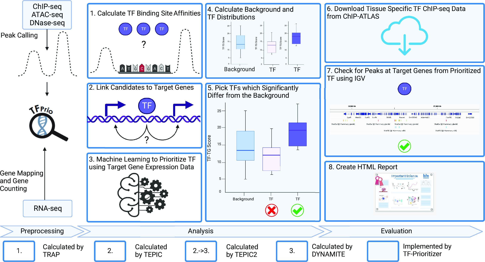

<h1>
  <picture>
    <source media="(prefers-color-scheme: dark)" srcset="docs/images/nf-core-tfactivity_logo_dark.png">
    
  </picture>
</h1>

[](https://github.com/nf-core/tfactivity/actions/workflows/ci.yml)
[](https://github.com/nf-core/tfactivity/actions/workflows/linting.yml)[](https://nf-co.re/tfactivity/results)[](https://doi.org/10.5281/zenodo.XXXXXXX)
[](https://www.nf-test.com)

[](https://www.nextflow.io/)
[](https://docs.conda.io/en/latest/)
[](https://www.docker.com/)
[](https://sylabs.io/docs/)
[](https://cloud.seqera.io/launch?pipeline=https://github.com/nf-core/tfactivity)

[](https://nfcore.slack.com/channels/tfactivity)[](https://twitter.com/nf_core)[](https://mstdn.science/@nf_core)[](https://www.youtube.com/c/nf-core)

## Introduction

**nf-core/tfactivity** is a bioinformatics pipeline that can identify the most differentially active transcription factors (TFs) between multiple conditions. It takes a count matrix and open chromatin data (ATAC-seq, DNase-seq, HM-ChIP-seq) as input. It produces a ranking of transcription factors.



1. Identify accessible regions (can perform footprinting between close ChIP-seq peaks or take ATAC-seq peaks)
2. Calculate affinity scores for combinations of transcription factors and target genes (TGs) using [STARE](https://doi.org/10.1093/bioinformatics/btad062)
3. Identify differentially expressed genes between conditions
4. Utilize linear regression to identify the transcription factors that are most likely to be responsible for the differential gene expression
5. Calculate the TF-TG score based on:
   1. Differential expression of the target genes
   2. Affinity of the transcription factors to the target genes
   3. The regression coefficient of the transcription factors
6. Perform a Mann-Whitney U test and create a ranking of the transcription factors

A more biological visualization of the workflow can be found here:

> [!NOTE]
> The following image was created for the TF-Prioritizer publication. Parts of the workflow have been adapted for the nf-core pipeline, but the general idea is still valid.



## Usage

> [!NOTE]
> If you are new to Nextflow and nf-core, please refer to [this page](https://nf-co.re/docs/usage/installation) on how to set-up Nextflow. Make sure to [test your setup](https://nf-co.re/docs/usage/introduction#how-to-run-a-pipeline) with `-profile test` before running the workflow on actual data.

The pipeline supports processing of previously called peaks from ATAC-seq, DNase-seq, or histone modification ChIP-seq data. The peaks can then either be used as-is or be subjected to footprinting analysis. Additionally, BAM files can be provided in a separate samplesheet, which will be used to predict enhancer regions.

```csv title="samplesheet.csv"
sample,condition,assay,peak_file
condition1_H3K27ac_1,condition1,H3K27ac,condition1_H3K27ac_1.broadPeak
condition1_H3K27ac_2,condition1,H3K27ac,condition1_H3K27ac_2.broadPeak
condition1_H3K4me3,condition1,H3K4me3,condition1_H3K4me3.broadPeak
condition2_H3K27ac,condition2,H3K27ac,condition2_H3K27ac.broadPeak
condition3_H3K27ac,condition3,H3K27ac,condition3_H3K27ac.broadPeak
condition3_H3K4me3,condition3,H3K4me3,condition3_H3K4me3.broadPeak
```

Each row represents a peak file. The `sample` column should contain a unique identifier for each peak file. The `peak_file` column should contain the path to the peak file. Peak files need to be in a format that is compatible with the `bed` format. Only the first three columns of the `bed` format are used.

```csv title="samplesheet_bam.csv"
sample,condition,assay,signal,control
condition1_H3K27ac_1,condition1,H3K27ac,condition1_H3K27ac_1.bam,condition1_control.bam
condition1_H3K27ac_2,condition1,H3K27ac,condition1_H3K27ac_2.bam,condition1_control.bam
condition1_H3K4me3,condition1,H3K4me3,condition1_H3K4me3.bam,condition1_control.bam
condition2_H3K27ac,condition2,H3K27ac,condition2_H3K27ac.bam,condition2_control.bam
condition3_H3K27ac,condition3,H3K27ac,condition3_H3K27ac.bam,condition3_control.bam
condition3_H3K4me3,condition3,H3K4me3,condition3_H3K4me3.bam,condition3_control.bam
```

The first three columns are the same as in the peak file samplesheet. The `signal` column should contain the path to the signal BAM file. The `control` column should contain the path to the control BAM file.

Second, you need a raw count matrix (e.g. from [nf-core/rnaseq](https://nf-co.re/rnaseq)) with gene IDs as rows and samples as columns. You also need a design matrix that specifies the conditions of the samples in the count matrix. The design matrix should look as follows:

```csv title="design_matrix.csv"
sample,condition
sample1,condition1
sample2,condition1
sample3,condition2
sample4,condition3
```

The `sample` column should match the columns in the expression matrix. The `condition` column is needs to match the `condition` column in the samplesheet. Additionally,batches can be added to the design matrix and will be considered in the differential expression analysis.

:::tip
There is an alternative way of providing expression values. Instead of providing a single count matrix for all samples, you can provide a gene list and one count file per sample. Details can be found in the [usage documentation](https://nf-co.re/tfactivity/usage).
:::

Now, you can run the pipeline using:

```bash
nextflow run nf-core/tfactivity \
   -profile <docker/singularity/.../institute> \
   --input samplesheet.csv \
   --genome GRCh38 \
   --counts <EXPRESSION_MATRIX> \
   --counts_design design_matrix.csv \
   --outdir <OUTDIR>
```

> [!WARNING]
> Please provide pipeline parameters via the CLI or Nextflow `-params-file` option. Custom config files including those provided by the `-c` Nextflow option can be used to provide any configuration _**except for parameters**_; see [docs](https://nf-co.re/docs/usage/getting_started/configuration#custom-configuration-files).

For more details and further functionality, please refer to the [usage documentation](https://nf-co.re/tfactivity/usage) and the [parameter documentation](https://nf-co.re/tfactivity/parameters).

## Pipeline output

To see the results of an example test run with a full size dataset refer to the [results](https://nf-co.re/tfactivity/results) tab on the nf-core website pipeline page.
For more details about the output files and reports, please refer to the
[output documentation](https://nf-co.re/tfactivity/output).

## Credits

nf-core/tfactivity was originally written by [Nico Trummer](https://github.com/nictru).

We thank the following people for their extensive assistance in the development of this pipeline:

- [Markus Hoffmann](https://scholar.google.com/citations?user=_qXUS28AAAAJ) (project and scientific management)
- [Leon Hafner](https://www.linkedin.com/in/leon-hafner/) (implementations)

## Contributions and Support

If you would like to contribute to this pipeline, please see the [contributing guidelines](.github/CONTRIBUTING.md).

For further information or help, don't hesitate to get in touch on the [Slack `#tfactivity` channel](https://nfcore.slack.com/channels/tfactivity) (you can join with [this invite](https://nf-co.re/join/slack)).

## Citations

> **TF-Prioritizer: a Java pipeline to prioritize condition-specific transcription factors**
>
> Markus Hoffmann, Nico Trummer, Leon Schwartz, Jakub Jankowski, Hye Kyung Lee, Lina-Liv Willruth, Olga Lazareva, Kevin Yuan, Nina Baumgarten, Florian Schmidt, Jan Baumbach, Marcel H Schulz, David B Blumenthal, Lothar Hennighausen & Markus List
>
> GigaScience, Volume 12, 2023, giad026, https://doi.org/10.1093/gigascience/giad026

<!-- TODO nf-core: Add citation for pipeline after first release. Uncomment lines below and update Zenodo doi and badge at the top of this file. -->
<!-- If you use nf-core/tfactivity for your analysis, please cite it using the following doi: [10.5281/zenodo.XXXXXX](https://doi.org/10.5281/zenodo.XXXXXX) -->

<!-- TODO nf-core: Add bibliography of tools and data used in your pipeline -->

An extensive list of references for the tools used by the pipeline can be found in the [`CITATIONS.md`](CITATIONS.md) file.

You can cite the `nf-core` publication as follows:

> **The nf-core framework for community-curated bioinformatics pipelines.**
>
> Philip Ewels, Alexander Peltzer, Sven Fillinger, Harshil Patel, Johannes Alneberg, Andreas Wilm, Maxime Ulysse Garcia, Paolo Di Tommaso & Sven Nahnsen.
>
> _Nat Biotechnol._ 2020 Feb 13. doi: [10.1038/s41587-020-0439-x](https://dx.doi.org/10.1038/s41587-020-0439-x).
